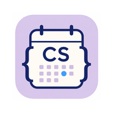

<div align="center">

# CS Schedule

**Мобильное приложение расписания факультета ИВТ ВГУ**

[](https://kotlinlang.org/)
[](https://developer.android.com/)
[](https://developer.android.com/jetpack/compose)

Импорт расписания с [cs.vsu.ru](https://www.cs.vsu.ru/rasp/) · офлайн-доступ · тёмная тема

</div>

---

## О проекте

**CS Schedule** — Android-приложение для просмотра расписания групп, преподавателей и занятости аудиторий факультета компьютерных наук ВГУ. Данные автоматически загружаются из Google Sheets, разбираются и сохраняются в локальную базу — расписание доступно без постоянного подключения к интернету.

## Возможности

- Импорт расписания с официального источника при запуске и по запросу
- Сохранение расписаний групп, преподавателей и аудиторий
- Поиск по сохранённым расписаниям
- Просмотр пар с разбивкой по числителю и знаменателю
- Тёмная тема с сохранением настройки между запусками
- Работа офлайн после первого импорта

## Демонстрация

<video src="documents/video.mp4" controls width="100%">
  Ваш браузер не поддерживает встроенное видео.
  <a href="documents/video.mp4">Скачать видео</a>
</video>

## Скриншот

<p align="center">
  
</p>

## Стек технологий

| Категория | Технологии |
|-----------|------------|
| Язык | Kotlin |
| UI | Jetpack Compose, Material 3 |
| Архитектура | ViewModel, Navigation Compose |
| Данные | Room, DataStore |
| Сеть | OkHttp, Jsoup |
| Сборка | Gradle Kotlin DSL, KSP |

## Сборка и установка

**Требования:** Android SDK, JDK 11+

```bash
git clone <url-репозитория>
cd CSSchedule
./gradlew assembleDebug
```

Готовый APK:

```
app/build/outputs/apk/debug/app-debug.apk
```

Установка на устройство через ADB:

```bash
adb install app/build/outputs/apk/debug/app-debug.apk
```

## Документация

| Файл | Описание |
|------|----------|
| [презентация.pdf](documents/презентация.pdf) | Презентация проекта (PDF) |
| [презентация.pptx](documents/презентация.pptx) | Презентация проекта (PowerPoint) |
| [Курсовая.pdf](documents/Курсовая.pdf) | Курсовая работа (PDF) |
| [Курсовая.docx](documents/Курсовая.docx) | Курсовая работа (Word) |
| [video.mp4](documents/video.mp4) | Видеодемонстрация приложения |

## Структура проекта

```
CSSchedule/
├── app/src/main/java/ru/vsu/csschedule/
│   ├── data/          # импорт, Room, репозитории
│   ├── ui/            # экраны Compose
│   └── navigation/    # навигация
├── documents/         # видео и материалы курсовой
└── app/schemas/       # схемы Room
```

## Лицензия

Учебный проект. Все права на исходные данные расписания принадлежат [факультету ИВТ ВГУ](https://www.cs.vsu.ru/).
